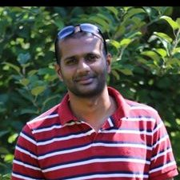

# About Me

Hi there! I'm **Francis Gnanamuthu**, Software developer and Technology enthusiast, write code for a living, Loves to talk about Microservices and DDD and I enjoy building backend Microservices in docker/building Serverless λ in python using AWS services. You can find me on twitter as [@franciscecil](https://twitter.com/franciscecil)